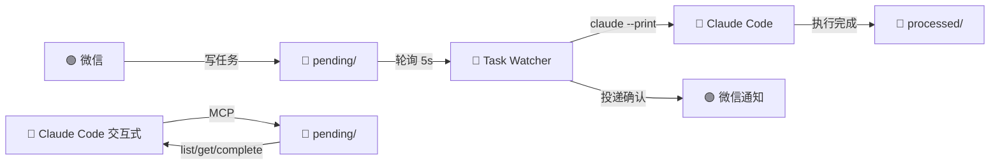

# OpenClaw ↔ Claude Code 双向桥接

<p align="center">
  
  
  
  
</p>

**让 Claude Code 成为 OpenClaw 的自动化执行引擎。**

你发微信 → OpenClaw 写入任务文件 → 守护进程 3 秒内捡起 → Claude Code 自动执行 → 微信汇报结果。

**不需要打开终端，不需要手动敲「检查任务」。**

## 为什么需要这个？

| 之前 😫 | 之后 😎 |
|---------|---------|
| 写完任务 → 打开 Claude Code → 手动输入「检查任务」 | 写完任务 → 该干嘛干嘛 |
| 等结果要反复查看终端 | 微信实时推送结果 |
| 半夜想跑个任务？明天再说 | 守护进程 24 小时在线 |
| 任务跑崩了不知道 | 失败/超时立刻微信告警 |
| Claude Code 开着时自动化冲突 | 并发保护自动退避 |

## 快速预览

写入一个任务文件，8 秒内收到微信：

```bash
cat > ~/.openclaw/workspace/tasks/pending/hello.md << 'EOF'
# task-source: openclaw
## 问候测试

给微信发一条消息：「👋 桥接测试成功！我是 Claude Code 自动执行的。」
EOF
```

微信 3 秒后收到消息，终端不用开。

## 架构



- **左路（自动化）**：Task Watcher 守护进程，无人值守执行
- **右路（交互式）**：Claude Code 对话中说「检查任务」，手动接管

## 安装

### 前置

- OpenClaw ≥ 2026.5.12，含 `openclaw-weixin` 插件
- Claude Code ≥ 2.1
- Linux（WSL2 可用）
- systemd user 实例

### 一键安装

```bash
git clone https://github.com/chenyitao123/openclaw-claude-bridge.git
cd openclaw-claude-bridge
bash setup.sh
```

`setup.sh` 会引导你填写 API key、Gateway token、微信账号。其余全自动。

### 手动安装

```bash
# 1. 任务队列
mkdir -p ~/.openclaw/workspace/tasks/{pending,completed,failed,processed}

# 2. MCP 服务器
cp configs/mcp.json.template ~/.mcp.json   # 编辑替换路径
cp scripts/mcp-task-bridge.js ~/bridge/

# 3. Claude Code Skill
mkdir -p ~/.claude/skills
cp skills/openclaw.md ~/.claude/skills/

# 4. 配置 Claude Code（参考 configs/*.template）
#    ~/.claude/settings.json        — API key + model
#    ~/.claude/settings.local.json  — 权限白名单 + 启用 MCP

# 5. 守护进程
cp scripts/task-watcher.sh ~/bin/
chmod +x ~/bin/task-watcher.sh
cp configs/systemd/task-watcher.service ~/.config/systemd/user/
systemctl --user daemon-reload
systemctl --user enable --now task-watcher.service

# 6. 验证
systemctl --user status task-watcher
```

## 使用

### 自动化模式（默认）

通过任何方式往 `pending/` 写 `.md` 文件，守护进程自动执行：

```bash
echo '# task-source: openclaw
## 每日总结
请分析今天 /home/user/work 下的 git log，生成工作简报发微信。' \
  > ~/.openclaw/workspace/tasks/pending/daily-summary.md
```

⚠️ 任务文件**必须包含** `# task-source: openclaw`，否则会被拦截。

### 交互模式

在 Claude Code 中说：**「检查任务」**

Skill 会通过 MCP 拉取任务列表，你选择执行。

### 发送微信通知

```bash
openclaw message send \
  --channel openclaw-weixin \
  --account <你的账号ID> \
  --target "<目标>@im.wechat" \
  --message "任务完成 ✅"
```

## 安全

| 机制 | 说明 |
|------|------|
| 🔐 来源标记 | 不含 `# task-source: openclaw` 的任务直接被拦截，微信告警 |
| ⏱️ 执行边界 | 单任务最长 10 分钟、最多 50 轮，防止死循环 |
| 🚦 并发保护 | 检测到 Claude Code 交互式会话时自动退避，不抢 API 额度 |
| 📁 错误隔离 | 失败任务进入 `failed/`，不影响后续任务 |
| 📊 可追溯 | 每一步都有日志 + 文件记录，`processed/` 保留所有执行历史 |

## 目录

```
openclaw-claude-bridge/
├── setup.sh                     # 一键安装
├── scripts/
│   ├── task-watcher.sh          # 守护进程（轮询→校验→执行→通知）
│   └── mcp-task-bridge.js       # MCP 服务器（list/get/complete）
├── skills/
│   └── openclaw.md              # Claude Code Skill
├── configs/
│   ├── *.json.template          # 配置模板（settings/mcp/openclaw）
│   └── systemd/                 # systemd 服务单元
└── docs/
    └── ARCHITECTURE.md          # 全链路架构文档
```

## FAQ

<details>
<summary><b>为什么开着 Claude Code 时任务不执行？</b></summary>
并发保护。两个实例会争抢 API 额度。关闭终端后 5 秒内自动恢复。
</details>

<details>
<summary><b>微信消息收不到？</b></summary>
<code>notify_wechat</code> 已内置 3 次重试 + 投递队列确认。仍然失败会写入 <code>notify-dead-letter.log</code>。
</details>

<details>
<summary><b>如何查看历史记录？</b></summary>
<code>ls ~/.openclaw/workspace/tasks/processed/</code>，每次执行独立保存。
</details>

<details>
<summary><b>能用其他模型（非 DeepSeek）吗？</b></summary>
可以。修改 <code>ANTHROPIC_BASE_URL</code> 为任意 Anthropic 兼容端点即可（如 OpenRouter）。
</details>

## License

MIT © 2026
