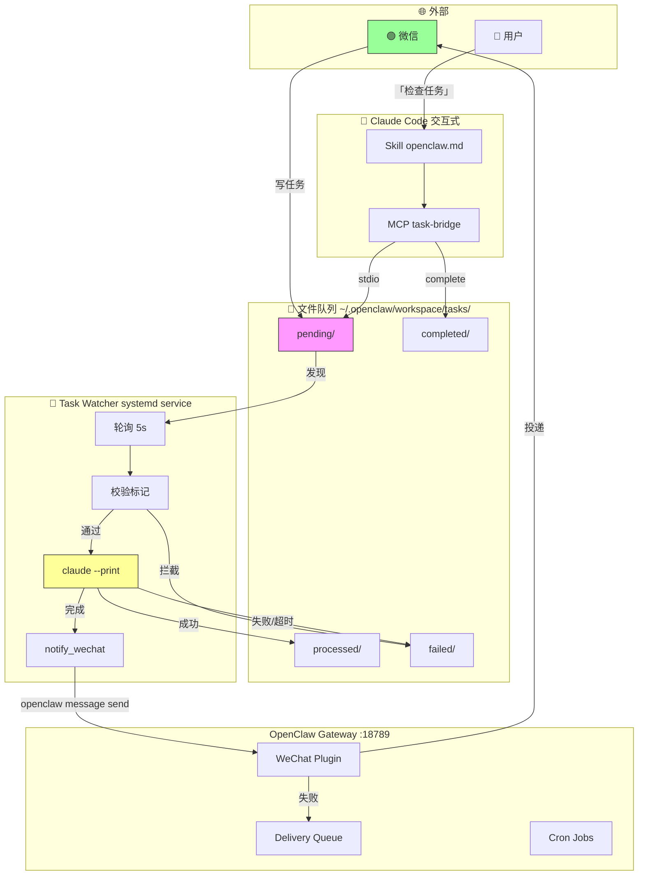
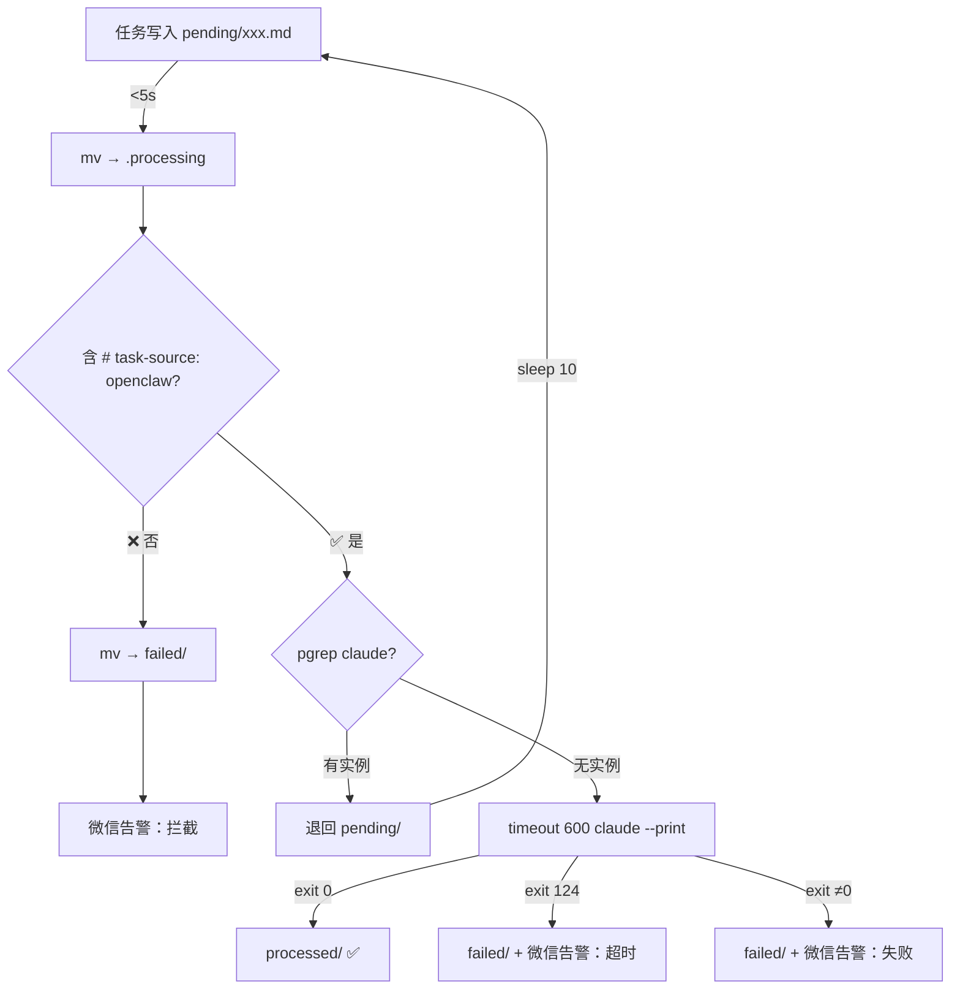
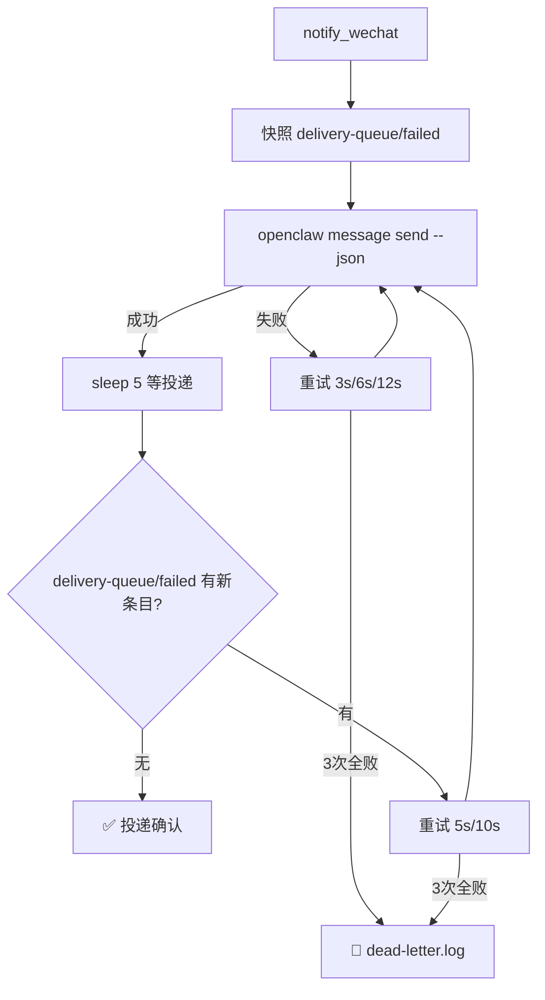

# 全链路架构

## 全景



## 组件

### 进程

| 组件 | 管理方式 | 职责 |
|------|---------|------|
| `openclaw-gateway.service` | systemd user | 网关核心，端口 18789 |
| `task-watcher.service` | systemd user | 轮询 pending → Claude Code headless 执行 → 微信通知 |
| `mcp-task-bridge.js` | MCP stdio | Claude Code spawn，暴露 list/get/complete |

### 关键文件

| 文件 | 作用 |
|------|------|
| `~/.openclaw/openclaw.json` | 网关 / 模型 / 插件 / 频道配置 |
| `~/.mcp.json` | MCP 服务器注册（task-bridge） |
| `~/.claude/settings.json` | API key / model / gateway URL |
| `~/.claude/settings.local.json` | 权限白名单 + MCP 启用开关 |
| `~/.claude/skills/openclaw.md` | 「检查任务」触发词 + 微信命令模板 |
| `~/bin/task-watcher.sh` | 守护脚本本体 |
| `~/bridge/mcp-task-bridge.js` | MCP 服务器本体 |

### 目录

```
~/.openclaw/workspace/tasks/
├── pending/       ← 待执行（任务入口）
├── completed/     ← MCP complete_task 归档
├── processed/     ← watcher 执行记录（含 claude --print 输出）
└── failed/        ← 拦截 / 超时 / 执行失败

~/.openclaw/delivery-queue/
└── failed/        ← 微信投递死信
```

## 数据流

### 自动化管道



### 微信通知（投递确认）



### 交互式通道

```
「检查任务」→ Skill → MCP list_tasks → 用户选择 → get_task → 执行 → complete_task
                                                       └── 不可用时 fallback: ls + cat + mv
```

## 安全

| 层级 | 措施 | 失败行为 |
|------|------|---------|
| 来源校验 | `grep "# task-source: openclaw"` | 拦截 → `failed/` → 微信告警 |
| 并发保护 | `pgrep -f claude` | 退回 `pending/`，10 秒后重试 |
| 时间限制 | `timeout 600`（10 分钟） | SIGTERM → 30s 后 SIGKILL |
| 轮次限制 | `--max-turns 50` | Claude Code 自行终止 |
| 通知可靠 | 3 次重试 + 投递队列检查 | 全败写入 dead-letter |
| 错误隔离 | 失败 → `failed/` | 保留现场，不影响下一条 |

## 设计决策

### 为什么文件队列？

不是用 MCP 直连、消息队列、HTTP webhook 等，而是**普通文件**：

- **解耦**：OpenClaw 不需要知道 Claude Code 在不在运行
- **持久化**：任务写入即落盘，重启不丢
- **可观测**：`ls` 就能看状态，`cat` 就能看内容，不用专用工具
- **零依赖**：不引入 Redis / RabbitMQ 等中间件

### 为什么双通道？

| | MCP（交互式） | Watcher（自动化） |
|------|-------------|----------------|
| 触发 | 用户对话 | 文件事件（轮询） |
| 上下文 | 含对话历史 | 独立 session |
| 审批 | 人工目视 | `bypassPermissions` |
| 适用 | 复杂任务、需要判断 | 定时、批量、无人值守 |

共享同一个 `pending/`，互补不冲突。

### 为什么检测 claude 进程？

两个 Claude Code 实例会同时消费 API 额度。`pgrep -f claude` 确保交互式会话运行时自动化暂停，关闭终端 5 秒内恢复。

## 已知限制

1. `openclaw message send` 返回成功 = Gateway 入队，实际微信投递异步；已通过投递确认机制缓解
2. 自动化任务在交互式 Claude Code 运行时不会执行（设计如此）
3. 依赖 systemd user 实例（需要 WSL2 或原生 Linux）
4. `claude --print` 的 headless 行为可能随 Claude Code 版本变化
